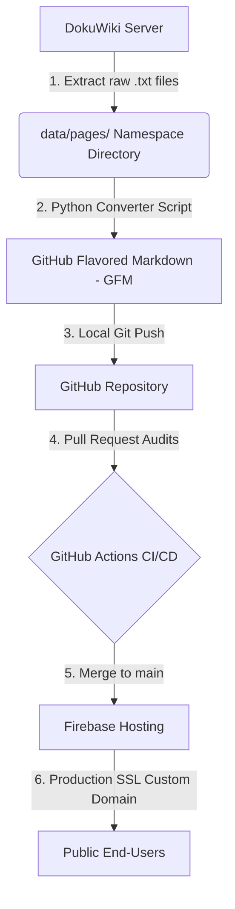

# IEEE Smart Village & OpenAMI Collaborative Repository
> **Migrating the DokuWiki Knowledgebase to a Version-Controlled GitHub & Firebase Serving Pipeline**

Welcome to the centralized, collaborative, and version-controlled archive for **IEEE Smart Village (ISV)** and the **OpenAMI Smart Metering Framework**. This repository represents a complete structural migration of the legacy knowledgebase at `wiki.smartvillage.ieee.org` (originally hosted on DokuWiki) into a modern, developer-friendly ecosystem.

By hosting our strategic reports, technical reference designs, and regulatory analyses on GitHub, we introduce **robust version control, pull-request audits, and structured collaborative editing**, while utilizing **Firebase Hosting** to serve beautiful, fast, and secure static pages over a custom domain.

---

## 🛠️ The DokuWiki-to-GitHub & Firebase Migration Blueprint

This repository is designed to facilitate the migration of `wiki.smartvillage.ieee.org`. Below is the official implementation blueprint for utility administrators and developers.



### Step 1: Extract Raw Data from DokuWiki Server
DokuWiki does not use a database; it stores all articles and namespace files as raw text files with a `.txt` extension on the web server.
1. Connect to the legacy server hosting `wiki.smartvillage.ieee.org` via SSH/SFTP.
2. Navigate to the core data folder: `/var/www/dokuwiki/data/pages/`.
3. Compress and download the directory:
   ```bash
   tar -czvf smartvillage_wiki_raw.tar.gz -C /var/www/dokuwiki/data/pages .
   ```

### Step 2: Convert DokuWiki Syntax to GitHub Flavored Markdown (GFM)
Convert the raw DokuWiki syntax (e.g. `===== header =====`, `[[link]]`, `**bold**`) to GFM.
1. Use an open-source DokuWiki to Markdown converter script (such as `dokuwiki-to-markdown-converter` in Python).
2. Run the recursion script:
   ```bash
   python dokuwiki_to_markdown.py --input ./raw_pages --output ./markdown-archive
   ```
3. This generates a clean, matching directory structure of `.md` files ready for GitHub.

### Step 3: Git Repository Configuration & Version Control
Initialize the workspace and add version-controlled editing:
1. Initialize Git in the root of the project:
   ```bash
   git init -b main
   ```
2. Configure exclusions in `.gitignore`:
   ```gitignore
   .firebase/
   firebase-debug.log
   node_modules/
   ```
3. Users can now edit reports locally using IDEs or directly on the GitHub web interface, submitting modifications via standard **Pull Requests (PRs)**.

### Step 4: Firebase Hosting Initialization
Configure the static serving engine:
1. Install the Firebase CLI tool:
   ```bash
   npm install -g firebase-tools
   ```
2. Log in and initialize Hosting (using our preconfigured `firebase.json` and `.firebaserc` files):
   ```bash
   firebase login
   ```

### Step 5: Automated CI/CD Deployments via GitHub Actions
We configure two automated workflows inside `.github/workflows/` utilizing `FIREBASE_SERVICE_ACCOUNT` tokens added as GitHub Secrets:
1. **Pull Requests (`firebase-hosting-pull-request.yml`):** Deploys a temporary staging "preview channel" for reviewers to test.
2. **Merge to Main (`firebase-hosting-merge.yml`):** Instantly builds and pushes the live code to the production server on merge approval.

---

## 📂 Formatted Reports Archive

Below is the directory of all formatted research papers, technical specs, and strategic pitches prepared for GitHub archiving and Firebase serving. All 9 reports are fully converted and archived as pristine GFM files.

### 📐 Technical Reference Designs & Specifications

* **OpenAMI Technical Reference Design (EMG-TRD-005):**
  * 🌐 [HTML Production View (Firebase)](/reports/openami-smart-metering-spec)
  * 📝 [GFM Markdown Code (GitHub)](/markdown-archive/openami-smart-metering-spec.md)
  * *Synopsis:* Verifiable blueprint detailing the Model IHM-4000 DCU hardware architecture, Wi-SUN sub-GHz mesh downlink relayer, 7 core communication use cases, 7-layer OSI & 5-layer SGAM mappings, and Type B earth-leakage life-safety systems (6mA DC / 30mA AC limits).

* **Motrike TrikeXplor E-Truck Upgrade Roadmap (TXE-CR-001):**
  * 🌐 [HTML Production View (Firebase)](/reports/trikexplor-etruck-critique)
  * 📝 [GFM Markdown Code (GitHub)](/markdown-archive/trikexplor-etruck-critique.md)
  * *Synopsis:* Engineering audit detailing structural roll cage corrections, suspension upgrade paths (Gabriel/Uno Minda coilovers), hydraulic braking, electrical BMS/dual controller refinements, and complete Bill of Materials.

---

### 🌍 Policy, Tariff, & Regulatory Frameworks

* **UN ECE Interoperability & Open-Source Guidelines (EMG-REG-006):**
  * 🌐 [HTML Production View (Firebase)](/reports/unece-interoperability-guidelines)
  * 📝 [GFM Markdown Code (GitHub)](/markdown-archive/unece-interoperability-guidelines.md)
  * *Synopsis:* Policy synthesis translating the 2025 UNECE guidelines on energy digitalization into concrete off-grid terms. Focuses on GridWise interoperability dimensions, OpenPAYGO token protocols, hybrid software models, and the Moldova NRPC Place of Consumption alphanumeric registry.

* **Prepaid Metering & NERC Regulations: Auditing SSA Equity (EMG-REG-003):**
  * 🌐 [HTML Production View (Firebase)](/reports/nerc-afur-minigrid-tariffs)
  * 📝 [GFM Markdown Code (GitHub)](/markdown-archive/nerc-afur-minigrid-tariffs.md)
  * *Synopsis:* Review of the NERC 2023 regulations and the AFUR tariff tool mandate, standardizing loss caps (4% technical / 3% commercial) and grid encroachment exit buyouts (DAV + 12-Month Revenue).

* **The Decentralized Energy Nexus: Solar Mini-Grids & Bioenergy (EMG-NEX-004):**
  * 🌐 [HTML Production View (Firebase)](/reports/cse-minigrid-biofuels-synthesis)
  * 📝 [GFM Markdown Code (GitHub)](/markdown-archive/cse-minigrid-biofuels-synthesis.md)
  * *Synopsis:* Strategic policy synthesis of the CSE 2026 bioenergy report and JREDA mini-grid assessment data, showcasing circular solar-biomass-eATV networks.

---

### 💰 Strategic Capital & Investment Pitches

* **OpenAMI & IEEE Smart Village Fundraising Prospectus (EMG-PITCH-007):**
  * 🌐 [HTML Production View (Firebase)](/reports/openami-funding-pitch)
  * 📝 [GFM Markdown Code (GitHub)](/markdown-archive/openami-funding-pitch.md)
  * *Synopsis:* Fundraising blueprint applying H.R. Moody's 22 laws and 10 commandments of fundraising. Outlines target donor mapping, a 4-stage gated capitalization roadmap ($5M target), and a donor objections log.

* **eATV MiniGrid SSA & South Asia Investment Pitch (EMG-PITCH-002):**
  * 🌐 [HTML Production View (Firebase)](/reports/eatv-minigrid-pitch)
  * 📝 [GFM Markdown Code (GitHub)](/markdown-archive/eatv-minigrid-pitch.md)
  * *Synopsis:* Integrated logistics and off-grid mobility pitch for rural transport networks in Sub-Saharan Africa and expanded South Asian markets (India, Bangladesh, Nepal, Sri Lanka).

---

### 🛺 Engineering, Vehicles, & Correspondence

* **Electric Cargo Vehicles as Productive-Use Anchors (EMG-SSA-V001):**
  * 🌐 [HTML Production View (Firebase)](/reports/eATV-minigrid-ssa-vehicles)
  * 📝 [GFM Markdown Code (GitHub)](/markdown-archive/eatv-minigrid-ssa-vehicles.md)
  * *Synopsis:* Performance comparison scoring of 7 off-road electric cargo vehicles for rural deployment as productive-use anchors.

* **Prepaid Metering Legacy Key Management in SSA (SSA-STS-LEGACY-2026-001):**
  * 🌐 [HTML Production View (Firebase)](/reports/STS-SubSaharanAfrica_Industry_Letter)
  * 📝 [GFM Markdown Code (GitHub)](/markdown-archive/sts-subsaharan-africa-industry-letter.md)
  * *Synopsis:* Formal industry correspondence with the STS Association regarding legacy encryption algorithms (EA07 DES vs. EA11 MISTY1), Decoder Key Generation, and self-management permissions.

---

## 🚀 Deployment Instructions

To push this entire workspace to the target GitHub repository and trigger the Firebase CI/CD deploy pipeline for the first time:

1. Stage and commit all files:
   ```bash
   git add .
   git commit -m "feat: Initial commit of migrated Smart Village wiki and OpenAMI GFM reports"
   ```
2. Secure your **Firebase Service Account Token** from the Google Cloud Console for the `smartvillage-openami` project. Add it as a secret named `FIREBASE_SERVICE_ACCOUNT_SMARTVILLAGE_OPENAMI` inside your repository settings on GitHub (`Settings > Secrets and variables > Actions`).
3. Push to the `main` branch on GitHub:
   ```bash
   git remote add origin https://github.com/rahulbhargavain/openami-smart-village.git
   git branch -M main
   git push -u origin main
   ```
4. GitHub Actions will pick up the push event, run security audits, compile the routing, and deploy all live HTML pages directly to **Firebase Hosting**.

---

*This migration framework was engineered by **Antigravity** (Google DeepMind Advanced Agentic Coding team) on May 28, 2026.*
